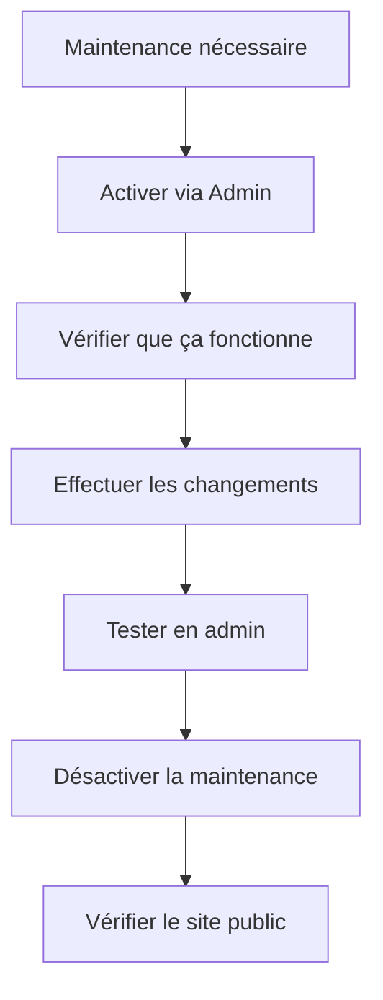

# 🔧 Mode Maintenance - Guide d'utilisation

## 📋 Vue d'ensemble

Le système de maintenance permet de rendre le site inaccessible au public tout en gardant l'accès administrateur fonctionnel.

## 🚀 Comment l'utiliser

### 1. **Activer la maintenance**
- Aller dans le dashboard admin (`/admin/dashboard`)
- Utiliser l'interrupteur dans la carte "Mode Maintenance"
- Confirmation automatique par toast

### 2. **Vérifier que ça fonctionne**
```bash
# Ouvrir une fenêtre de navigation privée
# Visiter votre site → doit rediriger vers /maintenance
```

### 3. **Désactiver la maintenance**
- Retourner dans le dashboard admin
- Désactiver l'interrupteur
- Le site redevient accessible

## 🎯 Fonctionnalités

### ✅ **Ce qui reste accessible**
- `/admin/*` - Panel d'administration complet
- `/api/admin/*` - APIs d'administration
- `/api/auth/*` - Authentification
- `/maintenance` - Page de maintenance

### ❌ **Ce qui est bloqué**
- Toutes les pages publiques (`/`, `/products`, etc.)
- APIs publiques
- Checkout et panier

## 🔧 Configuration

### **Variables d'environnement**
```bash
# .env
MAINTENANCE_MODE=false  # true pour activer
```

### **En production (Vercel)**
1. Aller dans Settings > Environment Variables
2. Ajouter/modifier `MAINTENANCE_MODE=true`
3. Redéployer l'application

## 📝 Personnalisation

### **Page de maintenance**
- Fichier: `app/maintenance/page.tsx`
- Styling: Tailwind CSS
- Icons: Lucide React

### **Chemins autorisés**
```typescript
// lib/maintenance.ts
export const MAINTENANCE_ALLOWED_PATHS = [
  '/admin',
  '/api/auth',
  '/api/admin',
  '/maintenance'
]
```

## 🚨 Cas d'usage typiques

### **Avant une mise à jour importante**
```bash
# 1. Activer la maintenance
# 2. Déployer les changements
# 3. Tester en admin
# 4. Désactiver la maintenance
```

### **Problème de production**
```bash
# 1. Activer immédiatement via l'admin
# 2. Investiguer le problème
# 3. Corriger et déployer
# 4. Désactiver la maintenance
```

## 💡 Tips

- **Test** : Toujours tester en navigation privée
- **Communication** : Informer l'équipe avant activation
- **Timing** : Activer pendant les heures creuses
- **Durée** : Garder les maintenances courtes

## 🔄 Workflow recommandé


